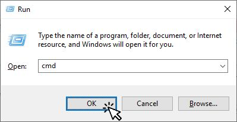

## Installer/vérifier Java

Le launcher Minecraft a un runtime Java intégré, mais vous aurez besoin
d'un runtime Java installé si vous utilisez MultiMC, ou si vous
souhaitez utiliser un runtime Java spécifique différent de celui intégré
à une installation du launcher Minecraft.

Vous devrez également avoir un runtime Java installé si vous utilisez la
version .jar de l'installateur Fabric.

------------------------------------------------------------------------

### ÉTAPE 1 : Vérifier si Java est déjà installé

Ouvrez la boîte de dialogue "Exécuter" en utilisant le raccourci clavier
Windows + R. Entrez "cmd" dans la zone de texte et cliquez sur "OK".
Cela ouvrira une invite de commandes.

Dans l'invite de commandes, écrivez `java -version` et appuyez sur
`Entrée`.

Si un numéro de version de Java est déjà installé, vous verrez quelque
chose comme ceci :

------------------------------------------------------------------------

### ÉTAPE 2 : Désinstaller des anciennes versions de Java

Si vous avez déjà installé Java et que vous souhaitez le mettre à jour
ou le remplacer, désinstallez d'abord toute version de Java installé
dans votre système, en utilisant la procédure normale du système
d'exploitation pour désinstaller des programmes.

------------------------------------------------------------------------

### ÉTAPE 3 : Installer Java

Pour télécharger l'installateur Java, allez
[ici](https://adoptopenjdk.net/releases.html).

Choisissez la version 8 du JRE et le JVM HotSpot, téléchargez
l'installateur pour votre système d'exploitation et installez Java.

Retournez à l'étape 1 pour vérifier que Java a été installé correctement
et qu'il fonctionne comme prévu.
